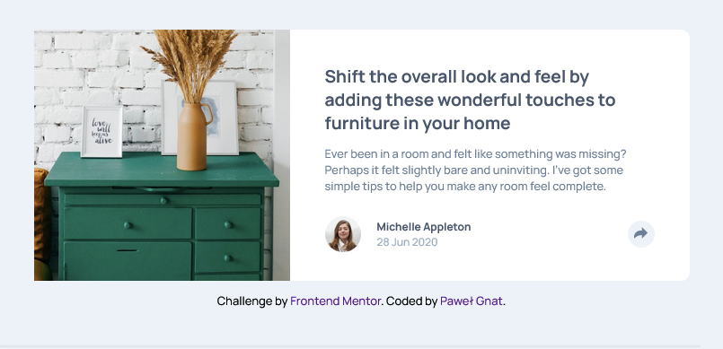

# Frontend Mentor - Article preview component solution

This is a solution to the [Article preview component challenge on Frontend Mentor](https://www.frontendmentor.io/challenges/article-preview-component-dYBN_pYFT). Frontend Mentor challenges help you improve your coding skills by building realistic projects.

## Table of contents

- [Overview](#overview)
  - [Screenshot](#screenshot)
  - [Links](#links)
- [My process](#my-process)
  - [Built with](#built-with)
  - [What I learned](#what-i-learned)
- [Author](#author)

## Overview

### Screenshot

### Links

- Live Site URL: [Article Preview Component](https://pawel-gnat.github.io/Frontend-Mentor-Article-Preview-Component/)

## My process

Below is my thinking process of Java Script code:

1. Created consts
2. Created a function that toggle a display of share div
3. Created a function that shows toggle background color of button
4. Created event on a button

### Built with

- Semantic HTML5 markup
- CSS custom properties
- Flexbox
- Mobile-first workflow
- JavaScript

### What I learned

I managed to do this challenge in 7 hours 40 minutes. Adding JavaScript and coding share section took me around 5-6 hours. I learned how to use ::after pseudoclass, changing the color of svgs on hover and I improved my JS skills a little.

## Author

- Frontend Mentor - [@Pawel-Gnat](https://www.frontendmentor.io/profile/Pawel-Gnat)
